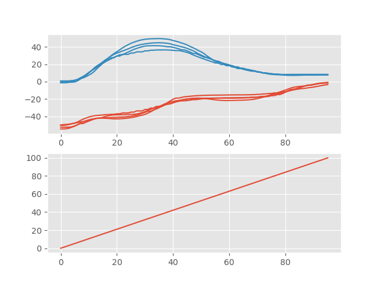
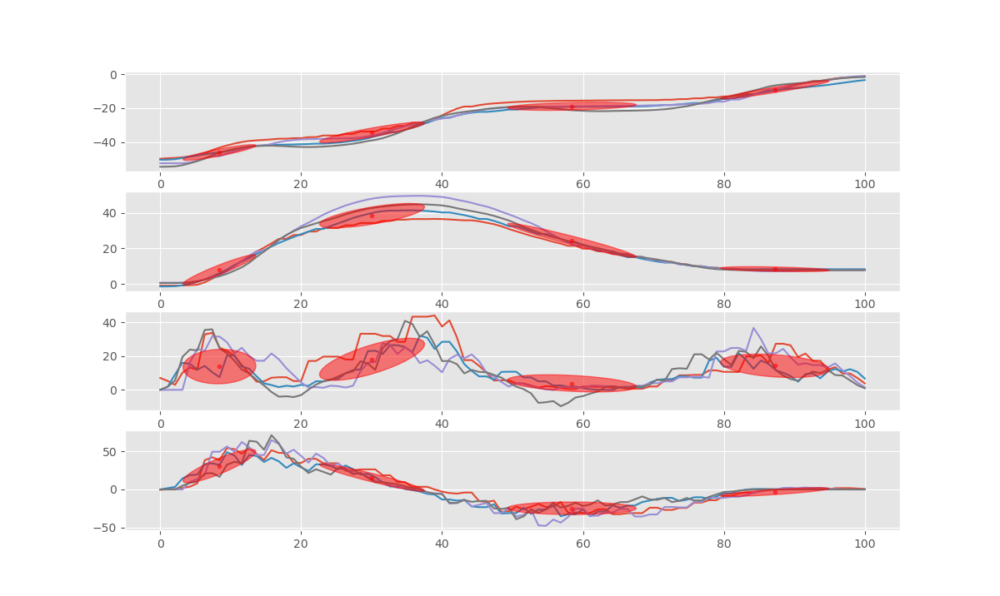
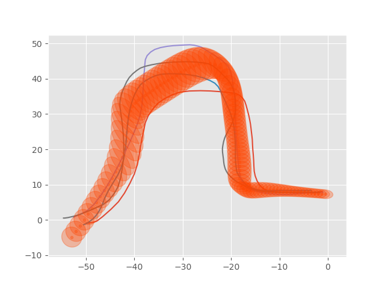

# GMM test
References: 
https://calinon.ch/codes.htm

### Pages related:

[Bayesian Gaussian mixture model for robotic policy imitation](https://gitlab.idiap.ch/rli/pbdlib-python/blob/master/pop/readme.md)

[Variational Inference with Mixture Model Approximation for Applications in Robotics](https://gitlab.idiap.ch/rli/pbdlib-python/blob/master/vmm/readme.md)


## Import python modules


```python
import os
import numpy as np
import matplotlib.pyplot as plt
import pbdlib as pbd
```

## Import generated fake data


```python
datapath = os.path.dirname(os.path.realpath(__file__))
print(datapath)
data = np.load(datapath + '/test_001.npy',allow_pickle=True,encoding="latin1")[()]

demos_x = data['x']  #Position data
demos_dx = data['dx'] # Velocity data
demos_xdx = [np.hstack([_x, _dx]) for _x ,_dx in zip(demos_x, demos_dx)] # Position-velocity
```

## Plot fake data


```python
for d in demos_x:
    plt.axes().set_prop_cycle(None)
    plt.plot(d)

plt.show()
```


As we can observe, not all the signals are perfectly alligned. We need to
apply DTW in order to fit GMM on this signals.


## DTW Signal


```python
demos_x, demos_dx, demos_xdx = pbd.utils.align_trajectories(demos_x, [demos_dx, demos_xdx])
t = np.linspace(0, 100, demos_x[0].shape[0])
```


```python
# DTW signals plot
fig, ax = plt.subplots(nrows=2)
for d in demos_x:
    ax[0].set_prop_cycle(None)
    ax[0].plot(d)
plt.show()
```





## The good stuff
Augment data with time, and initialize GMM model

```python
demos = [np.hstack([t[:,None], d]) for d in demos_xdx]
data = np.vstack([d for d in demos])

model = pbd.GMM(nb_states=4, nb_dim=5)

model.init_hmm_kbins(demos) # initializing model

# EM to train model
model.em(data, reg=[0.1, 1., 1., 1., 1.])


# plotting
fig, ax = plt.subplots(nrows=4)
fig.set_size_inches(12,7.5)

# position plotting
for i in range(4):
    for p in demos:
        ax[i].plot(p[:, 0], p[:, i + 1])
    pbd.plot_gmm(model.mu, model.sigma, ax=ax[i], dim=[0, i + 1])

plt.show()
```





## Plot GMMs


```python
mu, sigma = model.condition(t[:, None], dim_in=slice(0, 1), dim_out=slice(1, 5))

pbd.plot_gmm(mu, sigma, dim=[0, 1], color='orangered', alpha=0.3)

for d in demos_x:
    plt.plot(d[:, 0], d[:, 1])

plt.show()
```

